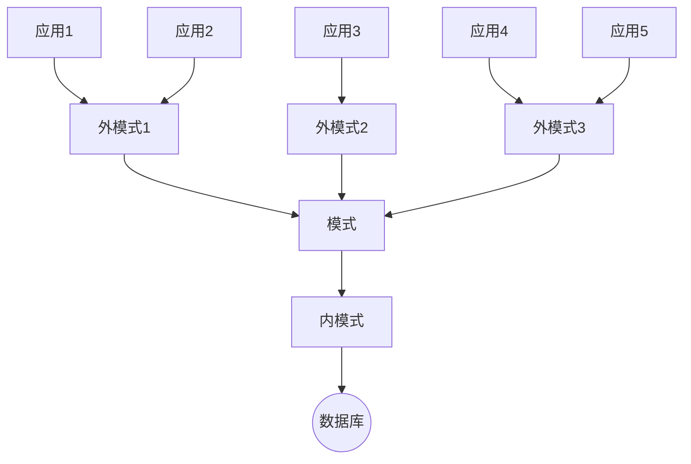

### 前言
本文主要对教材第一章主要知识点进行汇总。若有不足还请见谅。 
适用教材：《数据库原理与SQL Server 2012》(第二版） 
点击[此处](https://blog.csdn.net/qq2230550672/article/details/101458464)学习其他章节

---
### 1.数据库技术的发展历史
- 人工管理阶段
  1. 数据基本不保存
  2. 没有对数据进行管理的软件系统
  3. 没有文件的概念
  4. 数据不具有独立性 	
- 文件系统阶段
  1. 数据可以长期保存
  2. 由文件系统管理数据
  3. 文件的形式已经多样化
  4. 数据具有一定的独立性
- 数据库系统阶段
  1. 采用复杂的结构化数据模型
  2. 较高的数据独立性
  3. 最低的==冗余度==
  4. 数据控制功能 
  >数据冗余是指数据在存储器中的不必要的多次重复存储
 
### 2.数据库系统的基本概念
- **数据：** 数据库中存储的基本对象
- **数据库：** 存放数据的仓库，即计算机存储设备
- **数据库管理里系统：** 专门用于管理数据库的计算机系统软件，介于应用程序与操作系统之间
- **数据库系统：** 计算机系统中引入了数据库后的系统，由计算机硬件、软件、使用人员构成

> 数据库管理系统主要功能包括：数据库定义功能、数据库存取功能、数据库管理功能、数据库建立维护功能

==数据库强调的是数据，数据库管理系统强调的是系统软件，数据库系统强调的是系统==
### 3.数据库系统结构
从数据库系统管理角度看，数据库系统通常采用三级模式结构
三级结构包括：
- **外模式：** 也称子模式或用户模式，是数据库用户看到的数据视图，是与某一应用有关的数据的逻辑表示
- **模式：** 也称逻辑模式，是对数据库中全体数据库的逻辑结构和特征的描述，是所有用户的公共数据视图
- **内模式：** 也称存储模式，是数据在数据库系统内部的表示或底层描述，即对数据库物理结构和存储方式的描述

图1-1 数据库系统的三级模式结构 

### 4.数据库系统的二级映像
 - **外模式/模式的映像：** 模式描述的是数据的全局逻辑结构，外模式描述的是数据的局部逻辑结构。对于每一个外模式，数据库都有一个外模式/模式的映像，它定义并保证了外模式与数据模式之间的对应关系。这些==映像定义通常包含在各自的外模式中==
 - **模式/内模式的映像：** 数据库的内模式依赖于它的全局逻辑结构，即模式。由于一个数据库只有一个模式，也只有一个内模式，所以==模式/内模式的映像是唯一的==
### 课后习题
 1. 使用数据库系统有什么好处？
	(1) 查询迅速、准确，而且可以节约大量纸面文件
	(2) 数据结构化，并由DBMS统一管理
	(3) 数据冗余度小
	(4) 具有较高的数据独立性
	(5) 数据的共享性好
	(6) DBMS提供了数据的控制功能
2. 试述数据库系统的三级模式结构和二级映像的特点
	三级模式结构：数据库系统的三级模式是对数据的三个抽象级别，它把数据的具体组织留给DBMS管理，使用户能逻辑地、抽象地处理数据，而不必关心数据在计算机中的表示和存储
	二级映像：二级映像保证了数据库外模式的稳定性，从而从底层保证了应用程序的稳定性。数据与程序之间的独立性使得数据的存取由DBMS管理，用户不必考虑存取路径等细节，从而简化了应用程序的编制，大大减少了应用程序的维护和修改
3. 什么是数据与程序的逻辑独立性？什么是数据与程序的物理独立性？
	逻辑独立性是指用户的应用程序与数据库的逻辑结构是相互独立的，即，当数据的逻辑结构改变时，用户程序也可以不变。
	物理独立性是指用户的应用程序与存储在磁盘上的数据库中数据是相互独立的。即，数据在磁盘上怎样存储由DBMS管理，用户程序不需要了解，应用程序要处理的只是数据的逻辑结构，这样当数据的物理存储改变了，应用程序不用改变。 
	数据独立性的概念同现代程序设计语言中抽象数据类型的槪念在许多方面是相似 的。两者均为用户屏蔽具体实现的细节，使用户可以只考虑概括的结构，而不必考虑低层实现细节。
4. 常见数据库分类
