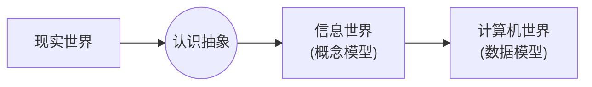
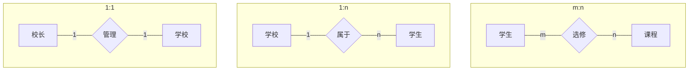

### 前言
本文主要对教材第二章主要知识点进行汇总。若有不足还请见谅。 
适用教材：《数据库原理与SQL Server 2012》(第二版） 
点击[此处](https://blog.csdn.net/qq2230550672/article/details/101458464)学习其他章节

---
随着科技的发展我们的世界变得越来越多姿多彩，在这样丰富的世界中信息也成为了重要的一部分，今天我们就来随着本文一起来感受一下计算机中的信息世界。
说了这么多，那么什么是信息呢？让我们用教材中的定义来解释一下。
> 信息就是通过各种方式传播的能被感受的声音、文字、图像、符号等。简单地说，信息就是新的、有用的事实和知识。

信息需要载体才能表示。信息通过加工可以用一系列的数据来表示，而在不同的领域中，数据的描述也有所不同
### 1.信息的三种世界
#### 1.1 现实世界
现实世界就是人们所能看到的、接触到的世界。
现实世界中主要涉及以下概念：
1. 实体（Entity）
	现实世界中可以区分的客观事物或概念。==通常表现为名词== 例如：人，书，星星，大象…
2. 实体的特征（Entity Characteristic）
	特征可用来区分不同的实体。例如：一个人的年龄，电视的大小，楼房的高低…
3. 实体集（Entity Set）及实体集间的联系（Relation）
	具有相同特征或能用相同特征描述的实体的集合称为实体集。
	例如：所有的人为人的实体集，所有的星星为星星的实体集
#### 1.2 信息世界
1. 实例（Example）
	实体通过其特征表示称为实例。实例与现实世界中的实体相对应。
2. 属性（Attribute）
	实体的特征在人们的思想意识中形成的知识称为属性。一个实例可拥有多个属性，能唯一标识一个实体的属性或属性集称为==码==（Key），每个属性的范围称为该==属性的域==（Domain）
3. 对象（Object）即对象间的联系（Relation）
	与现实世界中第三条类似，此处不做多余解释
#### 1.3 计算机世界
计算机世界又称数据世界，是将信息世界中的信息经过抽象和组织，按照特定的数据结构，即数据模型，将数据存储在计算机中
1. 字段
	用来标记实体的一个属性，它是可以命名的最小信息单元。例如：一个学生有学号、性别、年龄等字段。
2. 记录
	与现实世界中的实体对应
3. 文件
	同一类记录的集合。与信息世界中的对象对应。文件的存储形式有：顺序文件，链接文件，索引文件等
4. 文件集
	若干个文件的集合，与信息世界中对象集对应
#### 1.4 三种世界的转换

图 2-1 信息的三种世界之间的转换

表 2-1 信息的三种世界之间的对应关系

现实世界 | 信息世界 | 计算机世界
:-:|:-:|:-:
实体 | 实例 | 记录
特征| 属性|数据项
实体集|对象|文件
实体间的联系|对象间的联系|文件集
&nbsp;|概念模型|数据模型

### 2.概念模型
在把现实世界抽象为信息世界的过程中，实际上是抽象出现实系统中有应用价值的元素及其关联。这时形成的信息结构就是概念模型
概念模型用于信息世界的建模，是对现实世界的抽象和概括。
1. 实体
	客观存在并且可以相互区分的事物
2. 属性
	实体所具有的某一特征
3. 码
	能够在实体集中唯一标识一个实体的属性
4. 域
	某个（些）属性的取值范围
5. 实体性
	具有相同属性的实体具有共同的特征和性质。用实体名以及其属性名集合来抽象和刻画的同类实体。例如：学生(学号,姓名,性别)是一个实体性
6. 实体集
	同类型的实体集合
7. 联系
	- 一对一（1：1）
	- 一对多（1：n）
	- 多对多（m：n）

举个栗子：

图 2-2 两个实体之间的联系

>概念模型的表示方法很多，常见的有实体-联系法、扩充实体-联系法、面向对象模型法、谓词模型法。其中最著名也最常用的是实体-联系法。该方法用E-R图来描述现实世界的概念模型。

在E-R图中长方形表示实体，椭圆表示属性，菱形表示联系。

### 3.数据模型
数据模型是严格定义的一组概念的集合。精确的描述了系统的静态和动态特性，是数据库中用来对现实世界进行抽象的工具，是数据库系统的核心与基础，是描述数据的结构以及定义在其上的操作和约束条件
#### 3.1 数据模型的基本概念
1.  数据结构
	数据结构是相互之间存在一种或多种特定关系的对象元素的集合。
	根据对象元素之间关系的不同性质，通常由五种基本结构：集合、线形结构、树形结构、图状结构和关系结构。
2. 数据操作
	数据操作是指数据库中各对象的实例允许执行的操作的集合，包括操作及有关的操作规则。
	==数据库包括检索和更新（插入、删除、修改）两大类操作。==
3. 数据的完整性约束条件
	数据的约束条件是一组完整性规则的集合。
#### 3.2 常用的数据模型
**层次模型：**
1. 层次模型的定义及数据结构
	* 有且仅有一个节点，没有双亲结点，这个节点称为根节点
	* 除根结点之外的其他节点有且仅有一个双亲结点
2. 层次模型的数据操作和完整性约束条件
	* 在进行插入记录操作时，如果没有指明相应的父记录值，则不能插入子记录值
	* 在进行删除记录操作时，如果删除父记录值，则相应的子节点值也同时被删除
	* 进行修改记录操作时，如果记录之间有关系，则应修改所有相应记录，以保证数据的一致性
3. 层次模型的优点
	* 本身结构简单、清晰
	* 对于包含大量数据的数据库来说，采用层次模型来实现，其效率很高
	* 层次数据模型提供了良好的完整性支持
4. 层次模型的缺点
	* 层次模型表达能力有限，不能表示多对多联系
	* 数据冗余度增加，查询不灵活，特别是查询子节点必须通过双亲节点
	* 对插入和删除操作限制比较多
	* 编写应用程序比较复杂，开发效率较低

**网状模型：**
1. 网状模型的定义及数据结构
	* 有一个以上的节点没有父节点
	* 节点可以有多于一个的父节点
2. 网状模型的数据操作和完整性约束条件
	* 支持记录码的概念
	* 保证一个联系中父节点记录和子节点记录是一对多的联系
	* 可以支持父节点记录和子节点记录之间的某种约束条件
3. 网状模型的优点
	* 能够更直接地描述现实世界，能够表示实体之间的多种复杂联系
	* 具有良好的性能，存取效率高
4. 网状模型的缺点
	* 结构比较复杂，不利于数据库的扩充
	* 操作复杂，不利于用户掌握
	* 开发效率低

**关系模型：**
1. 关系模型术语
	* 关系：一个关系对应通常所说的一张二维表
	* 元组：表中一行称为一个元组
	* 属性：表中一列称为一个属性
	* 主码：能够唯一确定一个元组的属性或属性组
	* 域：属性的取值范围
	* 分量：元组中一个属性值
	* 关系模式：关系的型。一般表示为：关系名(属性1,属性2,...属性n)
	* 联系：在关系模型中，实体以及实体间的联系都用关系来表示
2. 关系模型的数据操作和完整性约束条件
	* 关系数据模型的操作主要包括查询、添加、修改和删除数据。数据之间还存在联系
	* 关系中的数据操作可看作是 集合或关系的操作，操作对象和操作结果都是集合（关系）。即操作的结果都是原表中导出的一个新表
	* 关系的完整性约束条件包括三大类：实体完整性、参照完整性和用户定义的完整性
3. 关系模型的特点
	* 建立在严格的数学基础上
	* 概念单一，结构清晰，容易理解
	* 关系数据模型的存取路径对用户是隐蔽的，但关系数据模型对用户是通用名的，从而简化了用户的工作，提高了效率
4. 关系模型的优点
	* 使用表的概念来表示实体间的联系，简单直观
	* 使用结构化查询语句，存取路径对用户透明，从而提高了数据的独立性，简化了程序员的工作
	* 建立在严格的数学概念的基础上，具有坚实的理论基础
5. 关系模型的缺点
	* 关系模型的连接等查询操作开销大，需要较高性能计算机的支持，所以必须提供查询优化功能

 **面向对象模型：**
 主要术语：
 * 对象
	现实世界中任一实体都被称为模型化的一个对象，每一个对象有唯一的标识
 * 封装
	每一个对象都有其状态，行为封装起来，其中状态就是该对象属性的集合，行为就是该对象方法的集合
* 类
	具有相同属性和方法的对象的集合。一个对象是某一类的一个实例